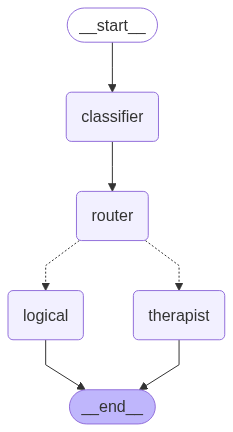

# Emotionally and Logically Adaptive Chatbot

> **Note:** This project was created to learn and get familiar with LangGraph and Langchain.

This project is a Python chatbot that uses LangChain, LangGraph, and Anthropic's Claude model to provide responses tailored to the user's needs. The chatbot automatically classifies each user message as requiring either an emotional (therapist-style) or logical (fact-based) response, and routes the conversation accordingly.

## Architecture



## Features
- **Message Classification:** Uses an LLM to determine if a message needs an emotional or logical reply.
- **Therapist Agent:** Responds with empathy and emotional support for personal or sensitive topics.
- **Logical Agent:** Provides direct, factual, and logical answers for information-seeking queries.
- **Stateful Conversation:** Maintains conversation state and message history using LangGraph.

## Usage
1. Install dependencies in a Python 3.12+ environment (see `pyproject.toml`).
2. Set your Anthropic API key and any other required environment variables in a `.env` file. You must have a line like this in your `.env`:
   ```env
   ANTHROPIC_API_KEY=your-anthropic-api-key-here
   ```
3. To run the chatbot in the terminal:
   ```bash
   python main.py
   ```
4. To run the web API and chat UI:
   ```bash
   python api.py
   ```
5. **To run with Docker:**
   - Build and start the app with Docker Compose:
     ```bash
     docker compose up --build
     ```
   - Or pull the prebuilt image from GHCR:
     ```bash
     docker pull ghcr.io/janatii/langgraph_chatbot:latest
     ```
     Then run:
     ```bash
     docker run --env-file .env -p 8000:8000 ghcr.io/janatii/langgraph_chatbot:latest
     ```
6. Open your browser and go to [http://localhost:8000](http://localhost:8000) to use the web chat interface.
7. Type your message and the assistant will reply appropriately.


## Requirements
- Python 3.12+
- LangChain
- LangGraph
- Anthropic (Claude)
- python-dotenv

## License
MIT License
